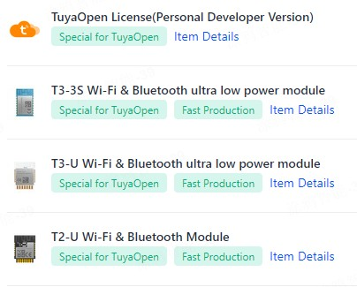

English | [简体中文](./README_zh.md)
# tuya.ai

By utilizing tuya.ai, this connects the Tuya Cloud and AI services to achieve AI voice interaction, audio/video multimodal AI interaction, intelligent control, and other functions.


## Applications
1. **Create a Product and Obtain the Product PID**
   - Refer to the documentation [https://developer.tuya.com/en/docs/iot-device-dev/application-creation?id=Kbxw7ket3aujc](https://developer.tuya.com/en/docs/iot-device-dev/application-creation?id=Kbxw7ket3aujc) to create a product on [https://iot.tuya.com](https://iot.tuya.com) and obtain the created product's PID.

   Then replace the `TUYA_PRODUCT_KEY` macro in the corresponding project directory's `tuya_config.h` file with the respective PIDs.

2. **Confirm TuyaOpen License Code**

    Tuyaopen Framework includes:
    - C Version TuyaOpen: [https://github.com/tuya/tuyaopen](https://github.com/tuya/tuyaopen)
    - Arduino Version TuyaOpen: [https://github.com/tuya/arduino-tuyaopen](https://github.com/tuya/arduino-tuyaopen)
    - Luanode Version TuyaOpen: [https://github.com/tuya/luanode-tuyaopen](https://github.com/tuya/luanode-tuyaopen)

    All use TuyaOpen specific license codes. Using other license codes will not allow normal connection to the Tuya Cloud.

    ```shell
    Replace the TUYA_DEVICE_UUID and TUYA_DEVICE_AUTHKEY contents, otherwise, the demo will not work.
    uuid: uuidxxxxxxxxxxxxxxxx, authkey: keyxxxxxxxxxxxxxxxxxxxxxxxxxxxxx
    ```

    You can obtain a TuyaOpen specific license code through the following methods:

    - **Method 1:** Purchase a module with a pre-burned TuyaOpen license code. This license code is already burned into the corresponding module and will not be lost. Tuyaopen reads the license code through the `tuya_iot_license_read()` interface at startup. Please confirm whether the current device has a burned TuyaOpen license code.

    - **Method 2:** If the current module does not have a burned TuyaOpen license code, you can purchase a **TuyaOpen license code** through [here](https://platform.tuya.com/purchase/index?type=6), and then replace the `TUYA_DEVICE_UUID` and `TUYA_DEVICE_AUTHKEY` in the [apps/tuya_cloud/switch_demo/src/tuya_config.h](./src/tuya_config.h) file with the obtained `uuid` and `authkey`.

    

    ```c
        tuya_iot_license_t license;

        if (OPRT_OK != tuya_iot_license_read(&license)) {
            license.uuid = TUYA_DEVICE_UUID;
            license.authkey = TUYA_DEVICE_AUTHKEY;
            PR_WARN("Replace the TUYA_DEVICE_UUID and TUYA_DEVICE_AUTHKEY contents, otherwise the demo cannot work");
        }
    ```

    > If the `tuya_iot_license_read()` interface returns OPRT_OK, it indicates that the current device has a burned TuyaOpen license code; otherwise, it means the current module does not have a burned TuyaOpen license code.


3. **Compile and Flash**
    You can use the `tos flash` command for one-click flashing. For details, refer to [https://github.com/tuya/TuyaOpen/blob/master/README_zh.md#%E7%83%A7%E5%BD%95](https://github.com/tuya/TuyaOpen/blob/master/README_zh.md#%E7%83%A7%E5%BD%95).

4. After using the Tuya app to network and activate the device, you can perform AI voice interaction through the microphone.

## AI Applications

### you_chat_bot
1. Supported Chip List

| Chip | Module |
| ----------------| ---------------- |
| [T5](https://developer.tuya.com/en/docs/iot/wifibt-dual-mode-chip?id=Ke3voh7uu0htz) | [T5-E1](https://developer.tuya.com/en/docs/iot/T5-E1-Module-Datasheet?id=Kdar6hf0kzmfi) [T5-E1-IPEX](https://developer.tuya.com/en/docs/iot/T5-E1-IPEX-Module-Datasheet?id=Kdskxvxe835tq) |


2. Supported Development Board List

| Development Board | Description |
| ----------- | ------------- |
| T5AI_Board | [https://developer.tuya.com/en/docs/iot-device-dev/T5-E1-IPEX-development-board?id=Ke9xehig1cabj](https://developer.tuya.com/en/docs/iot-device-dev/T5-E1-IPEX-development-board?id=Ke9xehig1cabj) |


## Free TuyaOpen License Code Activity

To allow developers to freely experience the Tuyaopen Framework, you can now star the Tuyaopen Framework development framework repositories on GitHub, including [https://github.com/tuya/tuyaopen](https://github.com/tuya/tuyaopen), [https://github.com/tuya/arduino-tuyaopen](https://github.com/tuya/arduino-tuyaopen), and [https://github.com/tuya/luanode-tuyaopen](https://github.com/tuya/luanode-tuyaopen), and send an email to `chenyisong@tuya.com` or join the QQ group `796221529` (the group owner will be sent the link) to receive a free TuyaOpen Framework specific license code.

Limited to 500 units, first come, first served. Hurry and scan the QR code to join the group👇:

