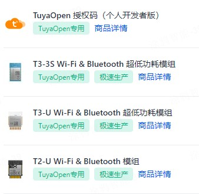

[English](./README.md) | 简体中文

# tuya.ai
通过 tuya.ai 提供的 AI ，连接涂鸦云 和 AI 服务，实现 AI 语音交互、音频/视频多模态 AI 交互、智能化控制等功能。


## 应用
1. 创建产品并获取产品的 PID
  参考文档 [https://developer.tuya.com/cn/docs/iot-device-dev/application-creation?id=Kbxw7ket3aujc](https://developer.tuya.com/cn/docs/iot-device-dev/application-creation?id=Kbxw7ket3aujc) 在 [https://iot.tuya.com](https://iot.tuya.com) 下创建产品，并获取到创建产品的 PID 。

  然后替换对应工程目录下 `tuya_config.h` 文件中 `TUYA_PRODUCT_KEY` 宏分别对应 pid。

2. 确认 TuyaOpen 授权码：

    Tuyaopen Framework 包括：
    - C 版 TuyaOpen：[https://github.com/tuya/TuyaOpen](https://github.com/tuya/TuyaOpen)
    - Arduino 版 TuyaOpen：[https://github.com/tuya/arduino-TuyaOpen](https://github.com/tuya/arduino-TuyaOpen)
    - Luanode 版 TuyaOpen：[https://github.com/tuya/luanode-TuyaOpen](https://github.com/tuya/luanode-TuyaOpen)

    均采用 TuyaOpen 专用授权码，使用其他授权码无法正常连接涂鸦云。

    ```shell
    Replace the TUYA_DEVICE_UUID and TUYA_DEVICE_AUTHKEY contents, otherwise the demo cannot work
    uuid uuidxxxxxxxxxxxxxxxx, authkey keyxxxxxxxxxxxxxxxxxxxxxxxxxxxxx
    ```

    可通过以下方式获取 TuyaOpen 专用授权码：

    - 方式1：购买已烧录 TuyaOpen 授权码模块。该授权码已经在出厂时烧录在对应模组中，且不会丢失。TuyaOpen 在启动时通过 `tuya_iot_license_read()` 接口读取授权码。请确认当前设备是否为烧录了 TuyaOpen 授权码。

    - 方式2：如当前模组未烧录 TuyaOpen 授权码，可通过 [https://platform.tuya.com/purchase/index?type=6](https://platform.tuya.com/purchase/index?type=6) 页面购买 ** TuyaOpen 授权码**，然后将 [apps/tuya_cloud/switch_demo/src/tuya_config.h](./src/tuya_config.h) 文件中 `TUYA_DEVICE_UUID` 和 `TUYA_DEVICE_AUTHKEY` 替换为购买成功后获取到的 `uuid` 和 `authkey`。

    - 方式3： 如当前模组未烧录 TuyaOpen 授权码，可通过 [https://item.taobao.com/item.htm?ft=t&id=911596682625&spm=a21dvs.23580594.0.0.621e2c1bzX1OIP](https://item.taobao.com/item.htm?ft=t&id=911596682625&spm=a21dvs.23580594.0.0.621e2c1bzX1OIP) 页面购买 ** TuyaOpen 授权码**，然后将 [apps/tuya_cloud/switch_demo/src/tuya_config.h](./src/tuya_config.h) 文件中 `TUYA_DEVICE_UUID` 和 `TUYA_DEVICE_AUTHKEY` 替换为购买成功后获取到的 `uuid` 和 `authkey`。

    

    ```c
        tuya_iot_license_t license;

        if (OPRT_OK != tuya_iot_license_read(&license)) {
            license.uuid = TUYA_DEVICE_UUID;
            license.authkey = TUYA_DEVICE_AUTHKEY;
            PR_WARN("Replace the TUYA_DEVICE_UUID and TUYA_DEVICE_AUTHKEY contents, otherwise the demo cannot work");
        }
    ```

    > 如 `tuya_iot_license_read()` 接口返回 OPRT_OK，则表示当前设备已经烧录了 TuyaOpen 授权码，否则表示当前模组并未烧录 TuyaOpen 授权码。


3. 编译烧录
    可使用 tos flash 命令进行一键烧录，具体请参考 [tos flash](https://github.com/tuya/TuyaOpen/blob/master/README_zh.md#%E7%83%A7%E5%BD%95)。

4. 使用 涂鸦 APP 配网激活设备后，即可通过麦克风进行 AI 语音交互。

## AI 应用

### you_chat_bot
1. 支持芯片列表

| 芯片 | 模组 |
| ---------------- | ---------------- |
| [T5](https://developer.tuya.com/cn/docs/iot/wifibt-dual-mode-chip?id=Ke3voh7uu0htz) | [T5-E1](https://developer.tuya.com/cn/docs/iot/T5-E1-Module-Datasheet?id=Kdar6hf0kzmfi) [T5-E1-IPEX](https://developer.tuya.com/cn/docs/iot/T5-E1-IPEX-Module-Datasheet?id=Kdskxvxe835tq) |
| ESP32S3 |  |

2. 支持开发板列表

| 开发板 | 描述 |
| ----------- | ------------- |
| T5AI_Board | [https://developer.tuya.com/cn/docs/iot-device-dev/T5-E1-IPEX-development-board?id=Ke9xehig1cabj](https://developer.tuya.com/cn/docs/iot-device-dev/T5-E1-IPEX-development-board?id=Ke9xehig1cabj) |
| T5AI_EVB | [https://oshwhub.com/flyingcys/t5ai_evb](https://oshwhub.com/flyingcys/t5ai_evb) |

## 免费赠送 TuyaOpen 授权码活动

为了让开发者们可以自由体验 Tuyaopen Framework，现在只要在 GitHub 上给 Tuyaopen Framework 开发框架仓库，包括 [https://github.com/tuya/TuyaOpen](https://github.com/tuya/TuyaOpen) 、[https://github.com/tuya/arduino-TuyaOpen](https://github.com/tuya/arduino-TuyaOpen) 和 [https://github.com/tuya/luanode-TuyaOpen](https://github.com/tuya/luanode-TuyaOpen) 仓库加 star，凭 github 账号和截图，发送邮件至 `chenyisong@tuya.com` 或 加入 QQ 群 `796221529` 向群主免费领取一个 TuyaOpen Framework 专用授权码。

限量 500 个，先到先得，送完即止，赶紧扫码加群来领👇：


