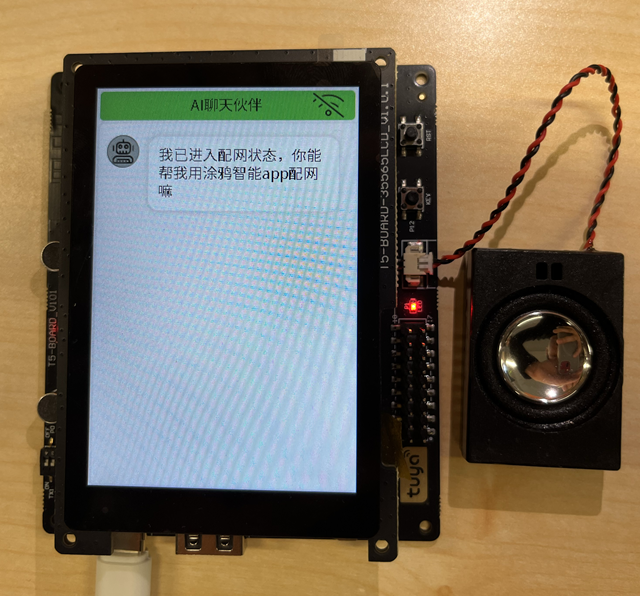

[English](./README.md) | 简体中文

# your_chat_bot
 [your_chat_bot](https://github.com/tuya/TuyaOpen/tree/master/apps/tuya.ai/your_chat_bot) 是基于 tuya.ai 开源的大模型智能聊天机器人。通过麦克风采集语音，语音识别，实现对话、互动、调侃，还能通过屏幕看到实时聊天内容。

## 支持功能

1. AI 智能对话
2. 按键唤醒/语音唤醒, 回合制对话，支持语音打断（需硬件支持）
3. 表情显示
4. 支持 LCD 显示实时聊天内容、支持 APP 端实时查看聊天内容
5. 蓝牙配网快捷连接路由器
6. APP 端实时切换 AI 智能体角色

## 依赖硬件能力
1. 音频采集
2. 音频播放

## 已支持硬件
|  型号  | config | 说明 | 重置方式 |
| --- | --- | --- | ----- |
| TUYA T5AI_Board 开发板 | TUYA_T5AI_BOARD_LCD_3.5.config | [https://developer.tuya.com/cn/docs/iot-device-dev/T5-E1-IPEX-development-board?id=Ke9xehig1cabj](https://developer.tuya.com/cn/docs/iot-device-dev/T5-E1-IPEX-development-board?id=Ke9xehig1cabj) | 重启(按 RST 按钮) 3 次重置 |
| TUYA T5AI_EVB 开发板 | TUYA_T5AI_EVB.config | [https://oshwhub.com/flyingcys/t5ai_evb](https://oshwhub.com/flyingcys/t5ai_evb) | 重启(按 RST 按钮) 3 次重置 |
| moji T5AI 版 | T5AI_MOJI_1.28.config |  | 重启(按 RST 按钮) 3 次重置 |
| 正点原子 ESP32S3BOX | DNESP32S3_BOX.config | [https://www.alientek.com/Product_Details/118.html](https://www.alientek.com/Product_Details/118.html) | 重启(按 RST 按钮) 3 次重置 |
| ESP32S3 面包板 | ESP32S3_BREAD_COMPACT_WIFI.config |  | 重启(按 RST 按钮) 3 次重置 |
| waveshare ESP32S3 1.8 英寸触摸 AMOLED 开发板 | WAVESHARE_ESP32S3_TOUCH_AMOLED_1_8.config | [https://www.waveshare.net/shop/ESP32-S3-Touch-AMOLED-1.8.htm](https://www.waveshare.net/shop/ESP32-S3-Touch-AMOLED-1.8.htm) | 重启(按 RST 按钮) 3 次重置 |
| ESP32S3 星智 0.96 OLED 开发板 | XINGZHI_Cube_0_96OLED_WIFI.config | [https://www.nologo.tech/product/esp32/esp32s3/esp32s3ai/esp32s3ai.html](https://www.nologo.tech/product/esp32/esp32s3/esp32s3ai/esp32s3ai.html) | 重启(按 RST 按钮) 3 次重置 |

## 编译
1. 运行 `tos config_choice` 命令， 选择当前运行的开发板。
2. 如需修改配置，请先运行 `tos menuconfig` 命令修改配置。
3. 运行 `tos build` 命令，编译工程。

## 配置说明

### 默认配置
- 随意对话模式，未开启 AEC，不支持打断
- 唤醒词：
  - T5AI 版本： 你好涂鸦
  - ESP32 版本：你好小智

### 通用配置

- **选择对话模式**

  - 长按对话模式

    | 宏                                     | 类型 | 说明                                   |
    | -------------------------------------- | ---- | -------------------------------------- |
    | ENABLE_CHAT_MODE_KEY_PRESS_HOLD_SINGEL | 布尔 | 按住按键后说话，一句话说完后松开按键。 |

  - 按键对话模式

    | 宏                                 | 类型 | 说明                                                         |
    | ---------------------------------- | ---- | ------------------------------------------------------------ |
    | ENABLE_CHAT_MODE_KEY_TRIG_VAD_FREE | 布尔 | 按一下按键，设备会进入/退出聆听状态。如果在聆听状态，会开启 vad 检测，此时可以进行对话。 |

  - 唤醒对话模式

    | 宏                                 | 类型 | 说明                                                         |
    | ---------------------------------- | ---- | ------------------------------------------------------------ |
    | ENABLE_CHAT_MODE_ASR_WAKEUP_SINGEL | 布尔 | 需要说出唤醒词才能唤醒设备，设备唤醒后会进入聆听状态，此时可以进行对话。每次唤醒只能进行一轮对话。如果想继续对话，需要再次用唤醒词唤醒。 |

  - 随意对话模式

    | 宏                               | 类型 | 说明                                                         |
    | -------------------------------- | ---- | ------------------------------------------------------------ |
    | ENABLE_CHAT_MODE_ASR_WAKEUP_FREE | 布尔 | 需要说出唤醒词才能唤醒设备，设备唤醒后会进入聆听状态，此时可以进行随意对话。如果 30S 没有检测到声音，则需要再次唤醒。 |

- **选择唤醒词**

  该配置只会在对话模式选择**唤醒对话**和**随意对话**两种模式下才会出现。

  | 宏                                    | 类型 | 说明                |
  | ------------------------------------- | ---- | ------------------- |
  | ENABLE_WAKEUP_KEYWORD_NIHAO_TUYA      | 布尔 | 唤醒词是 “你好涂鸦” |
  | ENABLE_WAKEUP_KEYWORD_NIHAO_XIAOZHI   | 布尔 | 唤醒词是 “你好小智” |
  | ENABLE_WAKEUP_KEYWORD_XIAOZHI_TONGXUE | 布尔 | 唤醒词是 “小智同学” |
  | ENABLE_WAKEUP_KEYWORD_XIAOZHI_GUANJIA | 布尔 | 唤醒词是 “小智管家” |

- **是否支持 AEC**

  | 宏         | 类型 | 说明                                                         |
  | ---------- | ---- | ------------------------------------------------------------ |
  | ENABLE_AEC | 布尔 | 这个是根据板子的硬件是否有回声消除功能来配置。 如果板子支持回声消除，则把该配置打开。**如果板子不支持回声消除，则需要关闭该功能，否则会影响唤醒对话功能**。 该配置没打开，则不支持语音打断的功能。 |

- **喇叭使能引脚**

  | 宏             | 类型 | 说明                                 |
  | -------------- | ---- | ------------------------------------ |
  | SPEAKER_EN_PIN | 数值 | 该引脚控制喇叭是否使能，范围：0-64。 |

- **对话按键引脚**

  | 宏              | 类型 | 说明                             |
  | --------------- | ---- | -------------------------------- |
  | CHAT_BUTTON_PIN | 数值 | 控制对话的按键引脚，范围：0-64。 |

- **指示灯引脚**

  | 宏                    | 类型 | 说明                                                       |
  | --------------------- | ---- | ---------------------------------------------------------- |
  | CHAT_INDICATE_LED_PIN | 数值 | 控制指示灯引脚，该指示灯主要用来显示对话状态，范围：0-64。 |

- **使能显示**

  | 宏                  | 类型 | 说明                                             |
  | ------------------- | ---- | ------------------------------------------------ |
  | ENABLE_CHAT_DISPLAY | 布尔 | 使能显示功能，如果板子有带屏幕，可将该功能打开。 |

### 显示配置

显示使能被打开后，以下配置才会出现。

- **选择显示 UI 风格**

  | 宏                 | 类型 | 说明                     |
  | ------------------ | ---- | ------------------------ |
  | ENABLE_GUI_WECHAT  | 布尔 | 类似微信聊天界面式风格   |
  | ENABLE_GUI_CHATBOT | 布尔 | 聊天盒子式风格           |
  | ENABLE_GUI_OLED    | 布尔 | 滑动字幕，适合 oled 小屏 |

- **使能文本流式显示**

  | 宏                        | 类型 | 说明                                                      |
  | ------------------------- | ---- | --------------------------------------------------------- |
  | ENABLE_GUI_STREAM_AI_TEXT | 布尔 | AI 回复的文本可进行流式的显示，而不是一下子出现文本内容。 |

- **选择OLED 屏类型**

  该配置只有在选择 OLED UI 风格时才会出现。

  | 宏                  | 类型 | 说明                        |
  | ------------------- | ---- | --------------------------- |
  | OLED_SSD1306_128X32 | 布尔 | oled 屏幕的尺寸大小为128*32 |
  | OLED_SSD1306_128X64 | 布尔 | oled 屏幕的尺寸大小为128*64 |