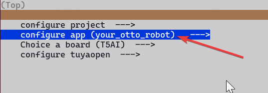

# 涂鸦T5AI版本 Otto机器人制作教程指南

## 项目概述

Otto Robot 是一个开源的人形机器人平台，支持多种功能扩展。本指南将帮助您快速搭建和配置属于自己的 Otto 机器人，并通过涂鸦智能APP实现远程控制。

## 演示视频

**点击观看效果**：[Otto 演示视频](https://t.tuya.com/AY1D3VxAQs)

## 一、材料清单

以下是制作 Otto Robot 所需的硬件材料：

### 1. 外壳

- **型号**： Otto Robot 3D打印机体外壳  
- **购买链接**：[闲鱼]

### 2. 舵机

- **型号**：SG90 180度舵机  
- **购买渠道**：淘宝

### 3. 显示屏

- **型号**：ST7789  
- **购买渠道**：淘宝

### 4. 开发板

- **型号**：T5 mini 开发板  
- **购买方式**：淘宝

## 二、硬件接线图

| 硬件设备 | 外设 | T5引脚 | 引脚功能      |
| -------- | ---- | ------ | ------------- |
| 屏幕     | SCL  | P14    | SPI0时钟      |
|          | CS   | P13    | SPI0片选      |
|          | SDA  | P16    | SPI0数据      |
|          | RST  | P19    | 屏幕复位      |
|          | DC   | P17    | 数据/命令选择 |
|          | BLK  | 可不接 | 屏幕背光      |
| 舵机     | PWM0 | P18    | 左腿舵机      |
|          | PWM1 | P24     | 右腿舵机      |
|          | PWM2 | P9    | 左脚舵机      |
|          | PWM3 | P34    | 右脚舵机      |

## 三、软件设计

### 1. 代码下载

- **主仓库**：https://github.com/tuya/TuyaOpen

### 2. 开发文档

- **文档地址**：[Tuya 开发文档](https://www.tuyaopen.io/en/master/)（先仔细阅读文档哦）

### 3. 配置修改

- **PID修改**：在文件 `apps/tuya.ai/your_otto_robot/include/tuya_config.h` 中

​    将 PID 修改为 `**pnax3fya1ctl5pst**`

- **UUID获取**：访问 [Tuya Open 仓库](https://github.com/tuya/TuyaOpen/tree/master) 点击 右上角"Star" 后进群获取 UUID
- **配置T5 mini开发板引脚：**在apps/tuya.ai/your_otto_robot/ 使用命令**：**tos menuconfig 按下图操作选择




- **选择st7789屏幕**：在apps/tuya.ai/your_otto_robot/ 使用命令：tos menuconfig 按下图操作选择

按照下图的0-5操作后保存


### 以上配置完成后保存：再tos build哦
编译完成后才会下拉platform/T5AI/tuyaos/tuyaos_adapter/src/driver/tkl_pwm.c文件
记得修改tpwm_chan_t ty_to_bk_pwm(TUYA_PWM_NUM_E ch_id)接口里面的PWM的映射表：
```
pwm_chan_t ty_to_bk_pwm(TUYA_PWM_NUM_E ch_id)
{
    pwm_chan_t pwm = PWM_ID_MAX;
    switch(ch_id) {
        case TUYA_PWM_NUM_0:
            pwm = PWM_ID_0;
        break;
        case TUYA_PWM_NUM_1:
            pwm = PWM_ID_4;
        break;
        case TUYA_PWM_NUM_2:
            pwm = PWM_ID_3;//改这行
        break;
        case TUYA_PWM_NUM_3:
            pwm = PWM_ID_8;
        break;
        case TUYA_PWM_NUM_4:
            pwm = PWM_ID_10;
        break;
        default:
        break;
    }

    return  pwm;
}
```

记得再次编译：tos build

### 4. 社区支持

- **企业微信群**


- **QQ群**：[加入涂鸦AI开发群](https://github.com/tuya/TuyaOpen/tree/master/apps/tuya.ai)（点star可以领取授权码）


## 四、固件烧录指南

### 1. 烧录准备（参考第二章）

1. 下载最新版本的固件 `.bin` 文件
2. 下载烧录工具或在 Linux 环境下使用 `tos` 命令
3. 使用 Type-C 数据线连接 T5 Mini 开发板

### 2. 烧录步骤

1. 打开烧录工具
2. 选择正确的 COM 端口
3. 设置芯片类型为 T5
4. 烧录地址设置为 `0x0`
5. 选择下载的固件文件
6. 点击 "Start" 开始烧录

## 五、控制效果确认

### 1. AI运动控制

1. 下载涂鸦智能APP
2. 在APP右上角添加子设备，选择 "机器人"
3. 进入控制界面，即可通过APP控制机器人实现：

- 左右移动
- 前后移动

4. 使用语音控制Otto机器人前后左右移动（唤醒词："你好，涂鸦"等）

### 2. AI聊天

1. 使用语音唤醒聊天（唤醒词："你好，涂鸦"等）

### 3. 功能清单

- 支持基本行走动作
- 支持语音指令控制
- 屏幕显示状态信息
- 支持视频识别（未来规划）

## 六、资源支持

- **技术交流**：加入涂鸦AI开发微信&QQ群获取技术支持
- **社区分享**：欢迎在 GitHub 或涂鸦开发者社区分享您的项目心得
  祝您成功打造属于自己的智能Otto机器人！

## 七、致谢

本项目感谢以下开源作者的支持：

1. [txp666]


本项目感谢以下开源项目的支持：

1. OttoDIYLib


本项目感谢以下开源社区的支持：

1. JLCEDA
