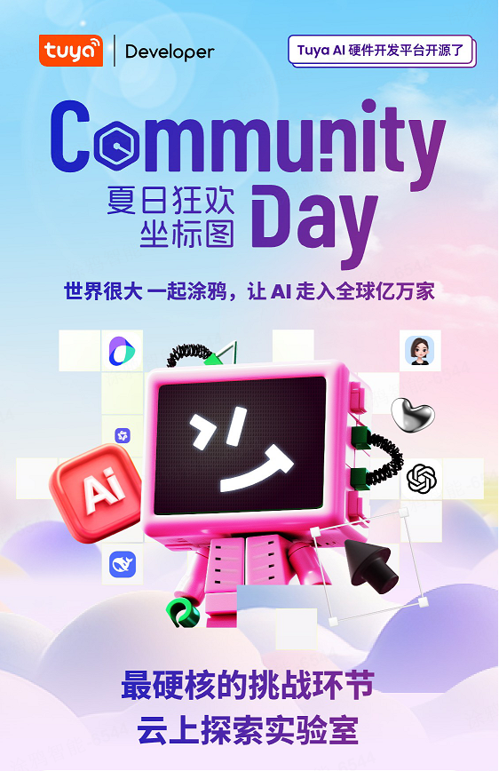

# AWS Community Day X TuyaOpen 快速指南 / Quick Guide

## 简介 / Introduction

**AWS Community Day X TuyaOpen** 是一场为期一天的开发者盛会，旨在帮助开发者探索如何将 AWS NOVA 大模型与 TuyaOpen 智能 AI+IoT 平台结合，开展创新项目开发。  
AWS Community Day X TuyaOpen is a one-day event designed to help developers explore how to combine AWS NOVA large models with the TuyaOpen AI+IoT platform for innovative project development.

通过本次 15 分钟的趣味实践，你将学习如何将 AI 大模型能力赋能于硬件设备，打造有趣且富有创意的产品。例如：智能家居助手、AI 陪伴机器人、AI 教育专家、AI 朋克机器人等。

Through this engaging 15-minute hands-on session, you will learn how to empower hardware with large AI model capabilities, enabling you to create innovative and exciting products such as smart home assistants, AI companion robots, AI education experts, and AI punk robots.

> 让我们一起动手实践吧！Let's get started! 🚀🤖

---

## 步骤指南 / Step-by-Step Guide
## Step 1：打开 TuyaOpen 仓库 Open the TuyaOpen Repository
- 访问仓库，克隆仓库 Clone this repository: [https://github.com/tuya/TuyaOpen/](https://github.com/tuya/TuyaOpen/)

## Step 2：阅读操作手册 Follow through the Manual

- 仔细阅读开发指南 Carefully read the development guide: [https://docs.tuyaopen.io/zh/master/quick_start/index.html](https://docs.tuyaopen.io/zh/master/quick_start/index.html)

## Step 3：在 Tuya AloT 平台创建智能体 Create a AI Agent Service on Tuya AloT Platform

- 创建智能体
- 选择 AWS NOVA 大模型
- Create an agent
- Select AWS NOVA large model

参考链接 / Reference: [https://tinyurl.com/99wanwnn](https://tinyurl.com/99wanwnn)

## Step 4：编译和烧录开发板 Build and Flash the Development Board
- 按照指引编译烧录开发板, Build and Flash the development board as instructed
- 参考链接 / Reference: [https://tinyurl.com/2eapmva8](https://tinyurl.com/2eapmva8)

## Step 5：下载 Tuya App/ Download Tuya App
- 请参照纸质手册绑定设备联网，设置Agent角色。  
- Please follow the printed manual to bind the device to the network and set the Agent role.

---
## 更多参考 / More References
- [TuyaOpen API 文档 / TuyaOpen API Docs](https://www.tuyaopen.io/zh/master/)
- [AWS 入门指南 / AWS Getting Started](https://aws.amazon.com/ai/generative-ai/nova/?trk=1325fdf1-f38b-4c89-8bf9-dc39eeb87ff8&sc_channel=ps&ef_id=Cj0KCQjwlrvBBhDnARIsAHEQgORqp2SxaMAsB7QxUe9md455dP75N_wKuk5i2N8-i4Ma403j368I6m8aAoq7EALw_wcB:G:s&s_kwcid=AL!4422!3!692062112135!e!!g!!aws%20nova!21054970946!157173566617&gad_campaignid=21054970946&gbraid=0AAAAADjHtp9dIyhMp7LzezN6FKoUi84ys&gclid=Cj0KCQjwlrvBBhDnARIsAHEQgORqp2SxaMAsB7QxUe9md455dP75N_wKuk5i2N8-i4Ma403j368I6m8aAoq7EALw_wcB)

---
祝您活动顺利！  
Wish you a successful event!
