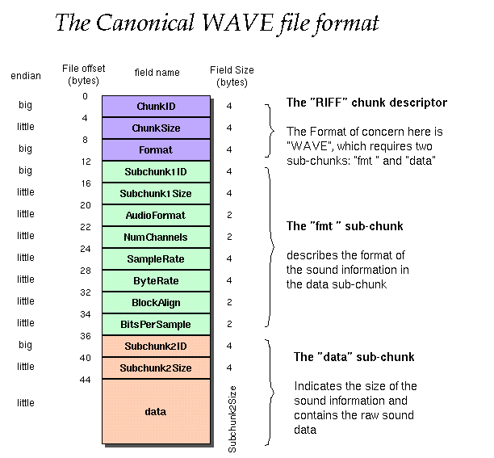

# Audio_recorder

## Introduction

A microphone is a common input device used to convert sound signals into electrical signals. This demo demonstrates how to capture audio data from a microphone and save it to internal flash or an SD card.

## Features

This example code shows how to initialize the microphone and audio system, capture audio data, and save it to a specified storage medium. The main features include:

1. Initialize the microphone and audio system.
2. Configure the audio sample rate (to allow the speaker to directly play the MIC received audio, the sample rate only supports 8kHz or 16kHz), sample bits (16 bits), and channel (1 channel).
3. Detect audio trigger signals via GPIO pins.
4. Use a ring buffer to store audio data.
5. Save audio data to internal flash or an SD card.
6. Read audio data from the storage medium and play it.

## File Structure

- `example_recorder.c`: Main code file containing the implementation of microphone initialization, audio capture, and storage.

## Usage

1. Ensure that the hardware connections are correct, and the microphone and SD card are connected to the development board.
2. Configure the `config` file in the project to enable `CONFIG_FATFS` to support the SD card file system.
3. Compile and flash the code to the development board.
4. Run the program, press the audio trigger button to start recording, release the button to stop recording and start playing the recorded audio.

## About PCM and WAV
The WAV format only requires adding a WAV header before the PCM data. The WAV header can be referenced in the following image:

## Notes

- Ensure that the SD card is correctly formatted and has sufficient storage space.
- Adjust the GPIO pins and audio parameters according to the actual hardware configuration.
- The recording duration is limited by the size of the ring buffer and the available space on the storage medium.
- This example currently uses only T5.